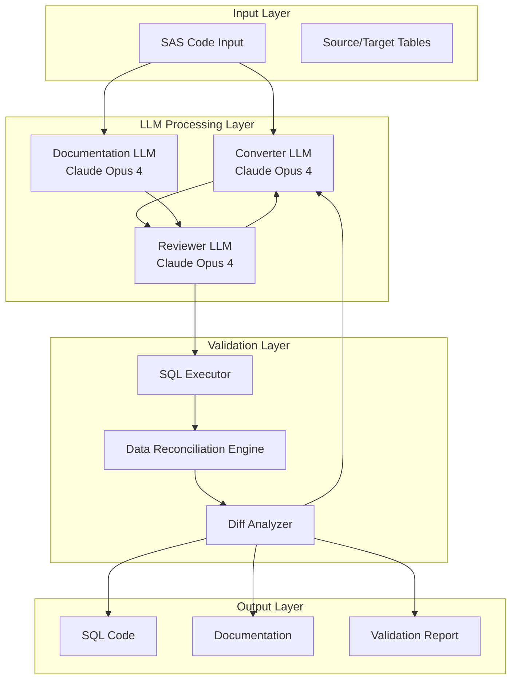

# Product Requirements Document
## SAS to SQL LLM-Driven Migration Platform

---

## Table of Contents

1. [Executive Summary](#executive-summary)
2. [Product Overview](#product-overview)
3. [Architecture Overview](#architecture-overview)
4. [Core Features & Workflow](#core-features--workflow)
5. [User Interface Requirements](#user-interface-requirements)
6. [Technical Requirements](#technical-requirements)
7. [Data Flow](#data-flow)
8. [Success Metrics](#success-metrics)
9. [MVP Scope](#mvp-scope)
10. [Future Enhancements](#future-enhancements)
11. [Risk Mitigation](#risk-mitigation)
12. [Appendix](#appendix)

---

## Executive Summary

### Problem Statement
Organizations with legacy SAS data platforms face significant challenges migrating to modern SQL-based systems. Manual migration is time-consuming, error-prone, and requires deep expertise in both SAS and SQL. Current migration tools lack intelligence and fail to ensure functional equivalence between migrated code.

### Solution
An LLM-driven migration platform that leverages Claude Opus 4 to automatically convert SAS code to SQL through an iterative, self-improving process with built-in quality assurance and data validation.

### Key Benefits
- **Automated Migration**: Reduces migration time from months to days
- **Quality Assurance**: Built-in review and validation ensures functional equivalence
- **Self-Improving**: Iterative feedback loop continuously improves conversion quality
- **Data Validation**: Automated reconciliation testing ensures identical outputs
- **Documentation**: Generates comprehensive documentation alongside code conversion

---

## Product Overview

### Vision
Create an intelligent, automated platform that enables organizations to migrate from SAS to SQL with confidence, ensuring functional equivalence and maintaining business logic integrity.

### Target Users
- **Primary**: Data Engineers migrating legacy SAS systems
- **Secondary**: Data Architects, Database Administrators, Analytics Teams
- **Tertiary**: Business Analysts requiring documentation of migrated processes

### Core Value Proposition
Reduce SAS to SQL migration effort by 90% while ensuring 100% functional equivalence through LLM-driven conversion, review, and validation.

---

## Architecture Overview

### System Components



### Component Descriptions

1. **Converter LLM**: Performs initial SAS to SQL conversion
2. **Documentation LLM**: Generates human-readable pseudo-code and documentation
3. **Reviewer LLM**: Analyzes conversion quality and provides improvement feedback
4. **Data Reconciliation Engine**: Compares SAS and SQL outputs for functional equivalence
5. **Orchestration Layer**: Manages the iterative workflow and state transitions

---

## Core Features & Workflow

### 1. Initial Conversion Phase

#### 1.1 SAS Code Analysis
- **Input**: SAS code files (.sas)
- **Process**: Parse and analyze SAS code structure
- **Output**: Structured representation for LLM processing

#### 1.2 Parallel Conversion
- **SQL Generation**: Convert SAS to functionally equivalent SQL
- **Documentation Generation**: Create human-readable pseudo-code and markdown documentation
- **Concurrency**: Both processes run in parallel using separate LLM instances

### 2. Review & Refinement Phase

#### 2.1 Quality Review
- **Inputs**: 
  - Original SAS code
  - Generated SQL code
  - Generated documentation
- **Process**: Reviewer LLM analyzes for:
  - Functional equivalence
  - SQL best practices
  - Performance considerations
  - Edge case handling
- **Output**: Structured feedback with specific improvement suggestions

#### 2.2 Iterative Refinement
- **Trigger**: Negative review feedback
- **Process**: 
  - Converter LLM receives feedback
  - Regenerates SQL incorporating suggestions
  - Documentation updated accordingly
- **Exit Criteria**: Positive review or maximum iteration limit

### 3. Data Validation Phase

#### 3.1 Test Execution
- **Setup**: 
  - Load source and target tables
  - Execute original SAS code
  - Execute generated SQL code
- **Environment**: Isolated test environment with production-like data

#### 3.2 Output Reconciliation
- **Process**:
  - Compare row counts
  - Compare column values
  - Identify discrepancies
- **Output**: Detailed diff report highlighting:
  - Missing rows
  - Extra rows
  - Value differences
  - Data type mismatches

#### 3.3 Validation Iteration
- **Trigger**: Failed reconciliation
- **Process**:
  - Feed diff report to Converter LLM
  - Regenerate SQL with corrections
  - Re-execute validation
- **Exit Criteria**: 100% match or manual intervention required

### 4. Finalization Phase

#### 4.1 Code Packaging
- **SQL Scripts**: Production-ready SQL code
- **Documentation**: Complete migration documentation
- **Validation Report**: Proof of functional equivalence

#### 4.2 Deployment Preparation
- **Version Control**: Commit to Git repository
- **Review Artifacts**: Generate PR with all changes
- **Migration Plan**: Step-by-step deployment guide

---

## User Interface Requirements

### IDE Integration (VSCode)

#### Extension Features
1. **SAS File Explorer**
   - Tree view of SAS programs
   - Batch selection for migration
   - Migration status indicators

2. **Migration Dashboard**
   - Real-time progress tracking
   - Phase status (Converting, Reviewing, Validating)
   - Error and warning summaries

3. **Interactive Review Panel**
   - Side-by-side SAS/SQL comparison
   - Inline feedback from Reviewer LLM
   - Manual override capabilities

4. **Validation Results Viewer**
   - Tabular diff visualization
   - Drill-down to specific discrepancies
   - Re-run validation controls

5. **Documentation Preview**
   - Live markdown rendering
   - Export to various formats
   - Integration with team wikis

### Command Palette Actions
- `SAS Migration: Start New Migration`
- `SAS Migration: Review Current Status`
- `SAS Migration: Run Validation`
- `SAS Migration: Export Documentation`
- `SAS Migration: Configure Settings`

### Configuration Interface
```json
{
  "sasMigration": {
    "llmProvider": "claude-opus-4",
    "maxIterations": 5,
    "validationSampleSize": 10000,
    "parallelProcessing": true,
    "outputFormat": "sql-server",
    "documentationLevel": "detailed"
  }
}
```

---

## Technical Requirements

### System Requirements
- **IDE**: VSCode 1.75+
- **Runtime**: Node.js 18+
- **Database Access**: JDBC/ODBC connections to source systems
- **Memory**: 16GB RAM minimum
- **Storage**: 100GB for test data caching

### API Requirements
- **Claude API**: Opus 4 model access with sufficient rate limits
- **Database APIs**: Read access to SAS datasets, write access to SQL test environment

### Performance Requirements
- **Conversion Speed**: < 5 minutes per 1000 lines of SAS code
- **Validation Speed**: < 10 minutes per million rows
- **Iteration Time**: < 2 minutes per refinement cycle

### Security Requirements
- **Data Encryption**: All data in transit and at rest
- **Access Control**: Role-based permissions for migration tasks
- **Audit Logging**: Complete trail of all conversions and validations
- **PII Handling**: Automatic detection and masking in test data

---

## Data Flow

### Input Data Requirements
1. **SAS Programs**
   - .sas files
   - Macro definitions
   - Format catalogs

2. **Test Data**
   - Representative sample datasets
   - Edge cases and boundary conditions
   - Historical output for comparison

### Processing Pipeline
```
SAS Code → Tokenization → LLM Processing → SQL Generation
                ↓                              ↓
          Documentation              Review & Feedback
                ↓                              ↓
          Validation ← ← ← ← ← ← ← ← Refinement
                ↓
          Final Output
```

### Output Artifacts
1. **SQL Code**
   - DDL for table creation
   - DML for data transformation
   - Stored procedures for complex logic

2. **Documentation**
   - Business logic explanation
   - Data lineage mapping
   - Migration notes and caveats

3. **Validation Reports**
   - Test execution logs
   - Reconciliation results
   - Performance comparisons

---

## Success Metrics

### Primary KPIs
- **Functional Equivalence Rate**: >99.9% of migrated code produces identical outputs
- **Migration Speed**: 10x faster than manual migration
- **First-Pass Success Rate**: >80% of conversions pass review without iteration

### Secondary Metrics
- **Documentation Quality Score**: >90% as rated by human reviewers
- **Performance Improvement**: Migrated SQL runs ≥ speed of original SAS
- **User Satisfaction**: >4.5/5 rating from migration teams

### Operational Metrics
- **LLM Token Usage**: Track and optimize API costs
- **Iteration Frequency**: Monitor average cycles to completion
- **Error Resolution Time**: Time from error detection to resolution

---

## MVP Scope

### Phase 1: Core Functionality (3 months)
- [ ] Basic SAS to SQL conversion
- [ ] Simple review mechanism
- [ ] Manual validation execution
- [ ] VSCode extension skeleton

### Phase 2: Automation (2 months)
- [ ] Automated review cycles
- [ ] Integrated validation engine
- [ ] Basic diff visualization
- [ ] Documentation generation

### Phase 3: Polish & Scale (1 month)
- [ ] Advanced UI features
- [ ] Batch processing
- [ ] Performance optimization
- [ ] Comprehensive testing

### Out of Scope for MVP
- Complex SAS macros
- Real-time collaboration
- Multi-dialect SQL support
- Custom LLM fine-tuning

---

## Future Enhancements

### Version 2.0
- **Multi-LLM Support**: Choice of AI providers
- **Collaborative Review**: Team-based migration workflows
- **Performance Profiling**: Automatic SQL optimization
- **Change Management**: Integration with CI/CD pipelines

### Version 3.0
- **Semantic Understanding**: Business rule extraction
- **Auto-Documentation**: Generate full technical specifications
- **Migration Planning**: AI-driven project timeline estimation
- **Cross-Platform**: Support for other legacy languages

---

## Risk Mitigation

### Technical Risks
| Risk | Impact | Mitigation |
|------|--------|------------|
| LLM hallucinations | Incorrect SQL generation | Multi-stage review process |
| API rate limits | Slow processing | Implement queuing and caching |
| Complex SAS logic | Failed conversion | Human-in-the-loop option |
| Large datasets | Validation timeout | Sampling strategies |

### Business Risks
| Risk | Impact | Mitigation |
|------|--------|------------|
| User adoption | Low usage | Comprehensive training program |
| Data security | Compliance issues | Enterprise security review |
| Cost overruns | Budget constraints | Usage monitoring and alerts |

---

## Appendix

### A. Glossary
- **SAS**: Statistical Analysis System
- **LLM**: Large Language Model
- **PRD**: Product Requirements Document
- **MVP**: Minimum Viable Product

### B. References
- SAS Documentation: [sas.com/documentation](https://sas.com/documentation)
- SQL Standards: ISO/IEC 9075
- Claude API Documentation: [anthropic.com/docs](https://anthropic.com/docs)

### C. Example Conversion

**Input SAS:**
```sas
data work.summary;
    set sales.transactions;
    by customer_id;
    if first.customer_id then total_sales = 0;
    total_sales + amount;
    if last.customer_id then output;
    keep customer_id total_sales;
run;
```

**Output SQL:**
```sql
CREATE TABLE summary AS
SELECT 
    customer_id,
    SUM(amount) as total_sales
FROM sales.transactions
GROUP BY customer_id;
```

**Generated Documentation:**
```markdown
## Summary Table Generation

### Purpose
Aggregate transaction amounts by customer to create a summary table.

### Logic
1. Groups transactions by customer_id
2. Sums the amount field for each customer
3. Outputs one row per customer with their total sales

### Input
- Table: sales.transactions
- Required fields: customer_id, amount

### Output  
- Table: summary
- Fields: customer_id, total_sales
```

---

*End of Document*